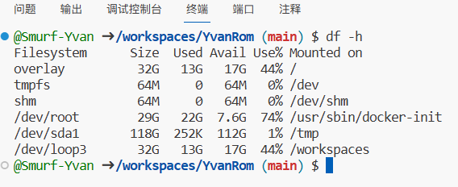

# Xiaomi HyperOS 官改制作
## 基于做包工具TIK 此仓库为Linux简易教程
## 使用教程
打开GitHub codespaces后,由于GitHub只给了workspace分区了32G（实际剩余如图），而tmp却有100多G之余（不知道是怎么想的），于是我们要把工作目录放至/tmp
### 你不使用codespace 除外

   ```bash
   cp -r TIK5 /tmp/ && cd /tmp/TIK5 && sudo ./run
   ```

## 其他命令
   ```bash
   sudo chmod 0755 *
   aria2c '' -s 64 -x 16 -c -o xxx.zip
   du -sh ./*
   sudo rm -rf /tmp/TIK5/你的项目名/super.img
   sudo rm -rf /tmp/TIK5/你的项目名/*.img
   sudo mv /tmp/TIK5/你的项目名/TI_out/super.img ./
   sudo apt install p7zip-full
   7z x xxx.7z -r -oxxx
   7z a -t7z -r HyperOS2.0.17.2.VJBCNXM_UMI_15.0-b4e6aff511.7z ./*
   ./OneDriveUploader -s "文件位置" "刷机包"
   ```
## zst 转换命令
   ```bash
   sudo apt update
   sudo apt install zstd -y
   sudo zstd  --rm -d super.zst -o /tmp/TIK5/你的项目名/super.img
   sudo zstd --rm super.img -o super.zst
   ```